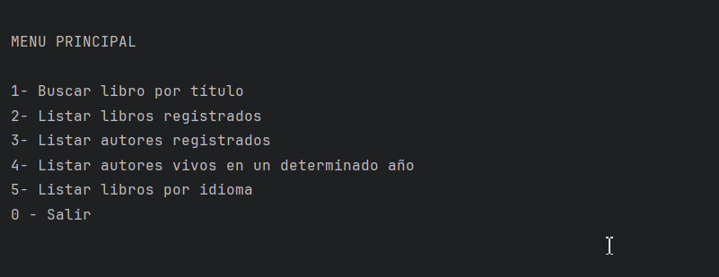
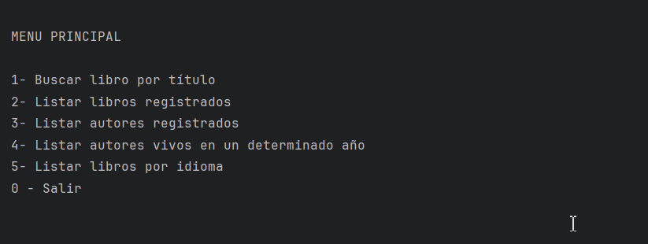
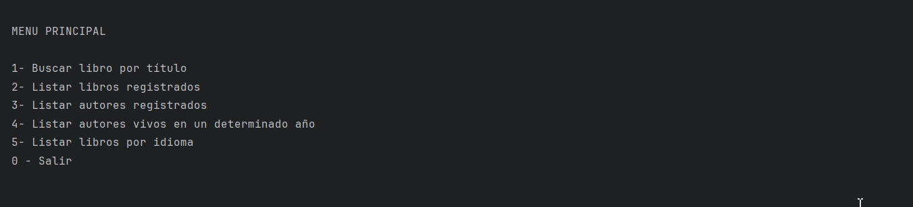
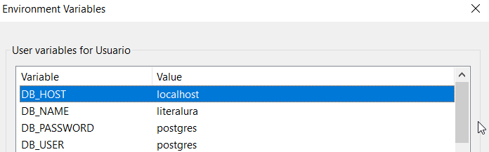

# LiterAlura 📚


LiterAlura es una emocionante aplicación de consola diseñada para crear tu propio catálogo de libros. En este viaje, aprenderás a realizar solicitudes a una API de libros, manejar datos JSON, guardarlos en una base de datos y, finalmente, filtrar y mostrar los libros y autores de interés.

## Características Principales

### Buscar y Registrar Libros por Título 📖
Solo esta funcionalidad busca un libro en la API gratuita https://gutendex.com/ y registra el libro encontrado en la base de datos, las demás funcionalidades consumen desde la Base de Datos PosgreSQL.



### Listar Libros Registrados 📚



### Listar Autores Registrados 🖋



### Listar Autores Vivos en un Determinado Año 🎭


### Listar Libros por Idioma 🌍


## Instalación 🔧

Si quieres tener este proyecto y desplegarlo localmente, sigue estos pasos:

### Pre-requisitos 📋

- Instalar Git
- Instalar IntelliJ (Recomendado).
- Instalar PostgreSQL.
- Configura tu password para el user "postgres" que es el superusuario.
- Crear una base de datos con cualquier nombre.

##### Variables de entorno

     

  DB_HOST: localhost por defecto.  
  DB_NAME: Es el nombre que asignaste a tu base de datos.  
  DB_PASSWORD: Contraseña que asignaste al usuario postgres.  
  DB_USER: postgres por defecto.


### Ejecución 💻

#### Clonar Repositorio

```bash
git clone https://github.com/ahuaracab/LiterAlura
```

- Abrir IntelliJ
- Open -> LiterAlura
- Espera a que se descarguen las dependencias de pom.xml o hacerlo manualmente
- Clic derecho en archivo LiteraluraApplication
- Run

## Autores ✒️

- **Angelo Huaraca** - _Back Developer_ - [ahuaracab](https://github.com/ahuaracab)

## Licencia 📄

Este proyecto está bajo la Licencia MIT - mire el archivo [LICENSE](LICENSE) para más detalles

## Expresiones de Gratitud 🎁

Quiero agradecer a Alura y Oracle por capacitarme en su programa ONE, sin ellos no hubiera podido tener las herramientas para desarrollar este desafío 🎓

---

⌨️ con ❤️ por [Angelo Huaraca](https://github.com/ahuaracab) 😊